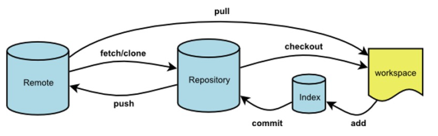

## 基本命令

```shell
git init  #进入需要git管理的目录，初始化此目录给git管理
git status
git add *
git commit -m "init commit"

# 比较不同
git diff xxx.py

# 版本回退
git reset --hard HEAD^  #直接恢复本地文件(会删除本地修改)
git reset --mixed HEAD^ #退回到add之前
git reset --soft HEAD^  #退回到commit之前
git checkout -- xxx.py  #在没有提交之前，可以恢复本地修改(会删除本地修改)

## 如果已经git push推送到远程，在使用git reset --hard HEAD^回退后，在push，远程仓库会拒绝，使用下面命令
git push --force # 强制推送

# 查看远程仓库地址
git remote -v

git clone url

# 查看config配置
git config -l
## 查看全局配置(比如用户，邮箱等)
git config --global -l

# 设置ssh key
$ ssh-keygen -t rsa -C l_lin@ruijie.com.cn
Generating public/private rsa key pair.
Enter file in which to save the key (/c/Users/linlei/.ssh/id_rsa):
/c/Users/linlei/.ssh/id_rsa already exists.
Overwrite (y/n)?
## 生成的id_rsa.pub文件内容就是ssh可以使用的内容
```

## 忽略文件

可以在git下属的任何目录下增加 .gitignore 文件，内容参考如下:

```shell
log*/  # 表示log开始的目录下的所有文件
*.pyc  # 表示以pyc结尾的文件
__pycache__/  # 表示任何__pycache__下的文件
```

## fetch与pull的关系



pull可以看成是fetch和merge的合并操作，git pull会拉取服务器上的内容，并且合并到当前工作空间，可能造成冲突，git fetch只是拉取下来，但是不merge，当检查无冲突后，由用户自己进行merge

```shell
git fetch origin master

# 更新后，返回FETCH_HEAD ，指某个branch在服务器上最新状态，可以在本地查看取回更新信息
git log -p FETCH_HEAD
git merge FETCH_HEAD    # 将拉取下来的最新内容合并到当前所在的分支中

# 等同于
git pull origin master
```

参考: [git fetch & pull详解](https://www.cnblogs.com/runnerjack/p/9342362.html)

## 搭建自己的中央仓储

Gitblit

## 使用场景

### 分支管理
